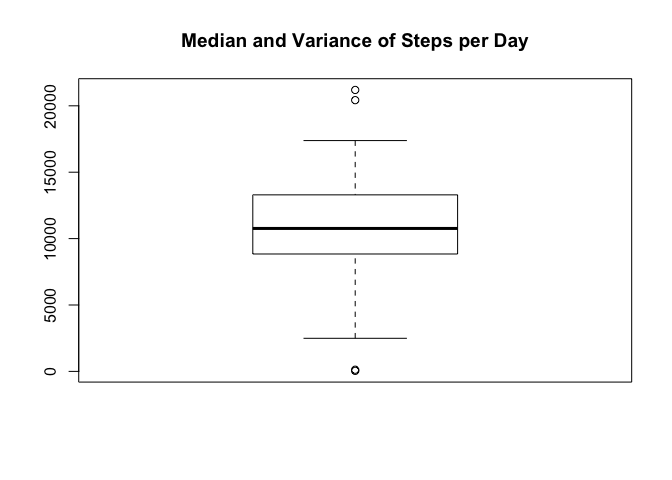
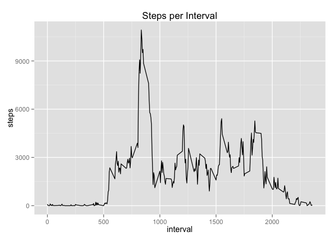
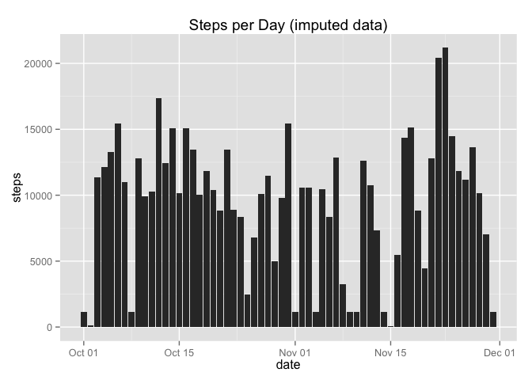
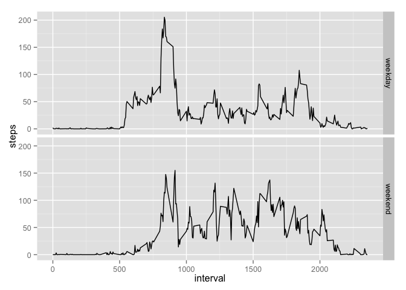

# Reproducible Research: Peer Assessment 1


## Loading and preprocessing the data


```r
## load ggplot2
library(ggplot2)

 ## if not already installed, get package timeDate, used for last part of assignement
    if (!require("timeDate"))
        install.packages("timeDate")
```

```
## Loading required package: timeDate
```

```r
library(timeDate)

## set locale to en_US so that we get English weekday abbreviations
Sys.setlocale("LC_TIME", "en_US")
```

```
## [1] "en_US"
```

```r
data <- read.csv("activity.csv")
data$date <- as.Date(data$date)
```


## What is mean total number of steps taken per day?

```r
stepsPerDay <- aggregate(steps ~ date, data = data, sum)

ggplot(data = stepsPerDay, aes(x = date, y = steps)) + geom_bar(stat =
                                                                        "identity") + ggtitle("Steps per Day")
```

 

```r
cat("Mean of steps ", mean(stepsPerDay$steps))
```

```
## Mean of steps  10766.19
```

```r
cat("Median of steps ", median(stepsPerDay$steps))
```

```
## Median of steps  10765
```

```r
boxplot(stepsPerDay$steps, main = "Median and Variance of Steps per Day")
```

 


## What is the average daily activity pattern?


```r
stepsPerInterval <- aggregate(steps ~ interval, data = data, sum)

ggplot(data = stepsPerInterval, aes(x = interval, y = steps)) + geom_line() + ggtitle("Steps per Interval")
```

 

```r
cat(
    "Interval",stepsPerInterval[stepsPerInterval[,"steps"] == max(stepsPerInterval$steps),"interval"], "has the maximum step count of", max(stepsPerInterval$steps)
  )
```

```
## Interval 835 has the maximum step count of 10927
```

## Imputing missing values


```r
## Calculate and report the total number of missing values in the dataset
narows <- !complete.cases(data)
cat("Number of incomplete cases (rows containing NA):", sum(narows))
```

```
## Number of incomplete cases (rows containing NA): 2304
```

```r
## Create a new dataset that is equal to the original dataset
dataImputed <- data

## fill NA values with median of intervals
stepsPerIntervalMedian <-
        aggregate(steps ~ interval, data = dataImputed, median)
    
    temp <- dataImputed[narows,]
    
    for (i in 1:dim(temp)[1]) {
        interval <- temp[i,"interval"]
        temp[i,"steps"] <-
            stepsPerIntervalMedian[stepsPerIntervalMedian$interval == interval, "steps"]
    }
    
dataImputed$steps[narows] <- temp$steps

## total number of steps taken each day
stepsPerDayImputed <- aggregate(steps ~ date, data = dataImputed, sum)

## plot number of steps per day of imputed data
    ggplot(data = stepsPerDayImputed, aes(x = date, y = steps)) + geom_bar(stat =
                                                                         "identity") + ggtitle("Steps per Day (imputed data)")
```

 

```r
## Calculate and report the mean and median total number of steps taken per day
cat("Mean of steps (imputed data)", mean(stepsPerDayImputed$steps))
```

```
## Mean of steps (imputed data) 9503.869
```

```r
cat("Median of steps (imputed data)", median(stepsPerDayImputed$steps))
```

```
## Median of steps (imputed data) 10395
```

```r
## Do these values differ from the estimates from the first part of the assignment?
cat("Difference of mean of steps", mean(stepsPerDayImputed$steps) - mean(stepsPerDay$steps))
```

```
## Difference of mean of steps -1262.32
```

```r
cat("Difference of median of steps", median(stepsPerDayImputed$steps) - median(stepsPerDay$steps))
```

```
## Difference of median of steps -370
```

```r
## What is the impact of imputing missing data on the estimates of the total daily number of
    ## steps?
    
    ggplot(data = NULL, aes(x = date, y = steps)) +
        geom_bar(data = stepsPerDayImputed, alpha = 0.5, stat = "identity"
        ) +
        ggtitle("Daily steps of imputed data")
```

 

## Are there differences in activity patterns between weekdays and weekends?


```r
    ## Create a new factor variable in the dataset with two levels – “weekday” and “weekend”
    ## indicating whether a given date is a weekday or weekend day.
    
    dataImputed$weekday  <- isWeekday(data$date)
    
    averages <- aggregate(steps ~ interval + weekday , data = dataImputed, mean)
    
    averages[averages$weekday == FALSE, "weekday" ]  <- "weekend"
    
    averages[averages$weekday == TRUE, "weekday" ]  <- "weekday"
    
    
    ggplot(averages, aes(interval, steps)) + geom_line() + facet_grid(weekday ~ .)
```

 
